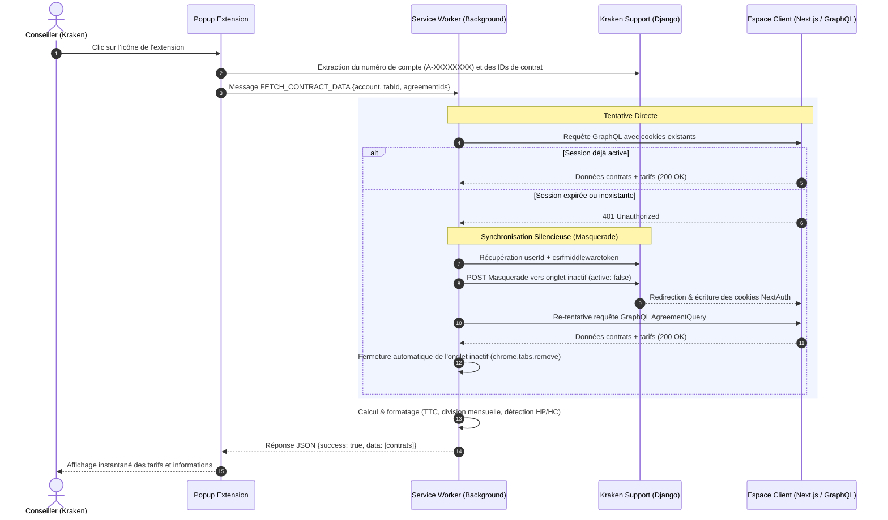

# 📘 Documentation Technique : Récupération & Synchronisation des Données

Ce document détaille l'architecture technique, les difficultés surmontées et les solutions mises en œuvre pour permettre à l'extension Chrome de récupérer et d'afficher instantanément les données complètes d'un contrat client (tarifs du kWh, abonnement, option tarifaire, PRM, puissance, etc.) directement depuis l'outil interne **Kraken Support** sans manipulation manuelle de l'utilisateur.

---

## 1. Contexte et Dualité des Écosystèmes

Pour comprendre pourquoi cette tâche a été particulièrement complexe, il faut appréhender les deux environnements distincts d'Octopus Energy :

| Environnement | URL | Technologie / Rôle |
| :--- | :--- | :--- |
| **Kraken Support** | `https://support.oefr-kraken.energy/` | Application interne (Django / HTMX). Contient les fiches conseillers, les identifiants techniques (`A-XXXXXXXX`, PRM, agreement IDs), mais **ne calcule pas les grilles tarifaires dynamiques** affichées au client. |
| **Espace Client** | `https://octopusenergy.fr/` | Application moderne (Next.js / GraphQL). C'est ici que sont calculés les prix du kWh (TTC/HT), les options tarifaires (Base, HP/HC), et les mensualités d'abonnement. |

L'objectif : **Depuis une page Kraken Support, obtenir les tarifs en temps réel de l'Espace Client en un seul clic sur l'extension, sans forcer le conseiller à ouvrir manuellement l'Espace Client ni quitter sa page de travail.**

---

## 2. Les 4 Défis Majeurs et Leurs Solutions

### Défi n°1 : Le rejet de l'origine de requête (Erreur `untrusted request origin`)

- **Le problème :** Lorsque l'extension appelait l'endpoint GraphQL `https://octopusenergy.fr/api/graphql/kraken`, le serveur Octopus renvoyait un code HTTP d'erreur :
  > `untrusted request origin`
  
  Le serveur vérifiait l'en-tête HTTP `Origin` : comme il s'agissait de `chrome-extension://<id>`, la requête était immédiatement bloquée par les protections anti-CSRF / CORS d'Octopus.
- **La solution (conforme MV3) :** 
  Conformément aux règles de sécurité d'entreprise du projet ([AGENTS.md](file:///Users/agnes.beaumatin1/Desktop/Boite%20%C3%A0%20outils/recapitulatif/AGENTS.md)), nous avons utilisé l'API officielle **`chrome.declarativeNetRequest`** avec un ensemble de règles déclaratives ([rules.json](file:///Users/agnes.beaumatin1/Desktop/Boite%20%C3%A0%20outils/recapitulatif/rules.json)).
  Cette règle intercepte les requêtes de l'extension vers l'API Octopus et modifie dynamiquement les en-têtes réseau pour présenter une origine de confiance :
  ```json
  "responseHeaders": [ ... ],
  "requestHeaders": [
    { "header": "Origin", "operation": "set", "value": "https://octopusenergy.fr" },
    { "header": "Referer", "operation": "set", "value": "https://octopusenergy.fr/" }
  ]
  ```

---

### Défi n°2 : L'Authentification et les Cookies `SameSite=Lax`

- **Le problème :** Même avec l'en-tête `Origin` correct, l'API répondait :
  > `API Octopus : unauthorized`
  
  L'API GraphQL exige des cookies de session NextAuth (`__Secure-next-auth.session-token`). Or :
  1. Le conseiller est connecté à **Kraken** (`support.oefr-kraken.energy`), pas directement à **l'Espace Client** (`octopusenergy.fr`).
  2. Les cookies de session possèdent le drapeau `SameSite=Lax`, ce qui interdit leur transmission lors de requêtes inter-origines ordinaires.
- **La solution (Le Masquerade Silencieux) :**
  Kraken dispose d'une fonctionnalité interne appelée **Masquerade** permettant à un conseiller d'incarner temporairement le compte d'un client.
  L'extension extrait automatiquement :
  1. L'identifiant utilisateur (`userId`) via les partials Kraken (`/accounts/<A-XXX>/partial/users-overview/`).
  2. Le jeton anti-CSRF Django (`csrfmiddlewaretoken`) depuis le DOM ou les cookies.
  3. Elle soumet un formulaire POST d'incarnation vers `/users/<userId>/masquerade/` avec pour destination l'Espace Client `octopusenergy.fr`.

---

### Défi n°3 : La Préservation du Focus et du Popup Chrome

- **Le problème classique de Chrome :** Si un script d'extension ouvre un nouvel onglet actif ou déclenche un changement de focus, **le popup de l'extension se referme instantanément** (comportement natif de Chrome). L'utilisateur devait alors ré-ouvrir le popup manuellement, et l'onglet client restait encombrant dans le navigateur.
- **La solution (L'Onglet Fantôme d'Arrière-Plan) :**
  Tout le processus a été déporté dans le **Background Service Worker** ([background.js](file:///Users/agnes.beaumatin1/Desktop/Boite%20%C3%A0%20outils/recapitulatif/background.js)) :
  1. Lors du clic, le formulaire de masquerade est envoyé vers un onglet configuré en **`active: false`**.
  2. L'onglet de travail Kraken reste focalisé à 100 % : **le popup ne se ferme jamais**.
  3. Le service worker surveille la redirection vers `octopusenergy.fr` via `chrome.tabs.onUpdated`.
  4. Dès que la session NextAuth est initialisée, la requête GraphQL est exécutée.
  5. **Fermeture garantie dans un bloc `finally` :** que la requête réussisse ou échoue, l'onglet temporaire est automatiquement détruit via `chrome.tabs.remove(createdTabId)`. Le conseiller ne voit passer aucun onglet indésirable.

---

### Défi n°4 : Le Piège GraphQL Relay sur le Prix du kWh (`rates`)

- **Le problème :** Après la synchronisation, l'abonnement s'affichait correctement (**15,08 €**), mais le prix du kWh affichait un tiret (**`-`**).
- **L'analyse technique approfondie :**
  Dans le schéma GraphQL Kraken :
  - Le champ `standingRate` (abonnement) est un objet simple direct (`SupplyProductRateType`). Il retournait donc immédiatement `pricePerUnitWithTaxes: 18096`.
  - Le champ `rates` (taux du kWh) est une **Connexion Relay Graphene-Django** (`RateConnection`).
  - En spécification Relay, lorsqu'un champ de connexion est interrogé **sans paramètre de pagination**, Graphene applique un découpage par défaut qui renvoie un tableau d'edges vide `[]`.
- **La solution :**
  1. Ajout explicite du paramètre de pagination : `rates(first: 10) { edges { node { ... } } }`.
  2. Interrogation directe des champs de l'interface `pricePerUnit` et `pricePerUnitWithTaxes`.
  3. Utilisation de fragments en ligne pour le typage concret de la classe temporelle :
     ```graphql
     ... on ElectricitySupplyConsumptionRateType {
       temporalClass { label }
     }
     ```
  4. Ajout d'une sécurité avec repli automatique : si jamais une offre spécifique rejetait l'argument `first: 10`, le script réessaie instantanément la requête sans casser le flux.

---

## 3. Schéma Global du Flux de Données



---

## 4. Structure de la Requête GraphQL Optimale

La requête finale utilisée par l'extension pour récupérer l'intégralité des données en un seul appel est la suivante :

```graphql
query AgreementQuery($agreementId: ID, $accountNumber: String!) {
  agreements(first: 10, agreementId: $agreementId, accountNumber: $accountNumber) {
    edges {
      node {
        id
        billingFrequency
        isActive
        status
        validFrom
        validTo
        product {
          code
          displayName
        }
        supplyPoint {
          marketName
          id
          externalIdentifier
          meterPoint {
            id
            isSmartMeter
            ... on ElectricityMeterPoint {
              subscribedMaxPower
              providerCalendar {
                name
                temporalClasses {
                  label
                  description
                }
              }
            }
            address {
              fullAddress
            }
          }
        }
        energySupplyRate {
          standingRate {
            pricePerUnit
            pricePerUnitWithTaxes
          }
          rates(first: 10) {
            edges {
              node {
                __typename
                pricePerUnit
                pricePerUnitWithTaxes
                ... on ElectricitySupplyConsumptionRateType {
                  temporalClass {
                    label
                  }
                }
                ... on ElectricityConsumptionRateType {
                  temporalClass {
                    label
                  }
                }
              }
            }
          }
        }
      }
    }
  }
}
```

---

## 5. Algorithme de Calcul et Conversion des Prix

Les montants renvoyés par l'API Kraken sont stockés sous forme de centimes d'euro annuels ou unitaires. L'extension applique les formules suivantes :

### A. Abonnement Mensuel TTC
$$\text{Abonnement Mensuel TTC} = \frac{\text{standingRate.pricePerUnitWithTaxes (c€/an)}}{100 \times \text{billingFrequency (généralement 12)}}$$

*Exemple sur le contrat test :*  
$18096\text{ c€} \div 100 = 180,96\text{ €/an TTC} \div 12 = \mathbf{15,08\text{ €/mois TTC}}$.

### B. Prix du kWh TTC
Les valeurs de `pricePerUnitWithTaxes` sont exprimées en centimes d'euro par kWh (ex: `15.48240`).  
- Si $\text{valeur} > 1$ : conversion en euros ($\div 100$), soit $0,1548\text{ €/kWh}$.
- Détection des options :
  - **Base :** Affichage d'un tarif unique (ex : `0,1548 €`).
  - **HP / HC :** Regroupement et affichage clair (`HP : 0,2516 € | HC : 0,1820 €`).

---

## 6. Récupération et Calcul du Suivi de Consommation Mensuel

Pour répondre à la demande d'affichage des données de consommation de l'onglet **« Mois »** (mois en cours et mois précédents), l'extension déploie une stratégie double pour récupérer les volumes en kWh et les valoriser financièrement :

### A. Requête GraphQL Télémétrie Linky (`electricityReading`) et Pagination Relay
L'endpoint `/api/graphql/kraken` permet d'extraire les séries temporelles de consommation Linky associées au PRM du client.  
Comme l'historique peut comporter plusieurs centaines de jours, l'extension effectue une **pagination Relay complète** (`first` et `after`) à travers le curseur `pageInfo.endCursor` pour récupérer l'intégralité des relevés jusqu'au jour le plus récent (ex: 16 septembre) :

```graphql
query GetElectricityReadings($accountNumber: String!, $prmId: String!, $first: Int, $after: String) {
  electricityReading(
    accountNumber: $accountNumber
    prmId: $prmId
    first: $first
    after: $after
    calendarType: PROVIDER
  ) {
    pageInfo {
      hasNextPage
      endCursor
    }
    edges {
      node {
        periodStartAt
        periodEndAt
        consumption
        temporalClass {
          ... on ProviderTemporalClassType {
            label
            code
          }
        }
      }
    }
  }
}
```

```

### B. Requête Officielle Espace Client : `GetPropertyMeasurements` (Méthode Principale)
Pour obtenir les montants en euros **rigoureusement identiques au centime près** à ceux affichés sur l'Espace Client, l'extension utilise la requête GraphQL officielle exécutée par le site Octopus Energy lors de la sélection du mode « Mois » :

```graphql
query GetPropertyMeasurements($propertyId: ID!, $startAt: DateTime!, $endAt: DateTime!, $utilityFilters: [UtilityFiltersInput]!, $first: Int) {
  property(id: $propertyId) {
    measurements(
      startAt: $startAt
      endAt: $endAt
      utilityFilters: $utilityFilters
      first: $first
    ) {
      edges {
        node {
          ...IntervalMeasurement
        }
      }
    }
  }
}

fragment IntervalMeasurement on IntervalMeasurementType {
  __typename
  value
  startAt
  source
  metaData {
    statistics {
      costInclTax {
        estimatedAmount
        costCurrency
      }
      label
      value
    }
  }
}
```

#### Pourquoi cette requête est indispensable (Taxes et Tarifs Historiques)
1. **Changements de taxes (ex : 1er août 2026) :**
   Une formule recalculée a posteriori avec le tarif actuel du contrat ($\text{kWh} \times \text{Tarif actuel}$) serait mathématiquement fausse pour les mois passés (ex : mai, juin, juillet 2026) car les taxes sur l'électricité ont augmenté le 1er août (hausse des accises / CSPE).
2. **Coût TTC officiel pré-calculé (en centimes d'euro) :**
   Le champ `metaData.statistics.costInclTax.estimatedAmount` contient le montant TTC exact calculé par Octopus Energy au jour le jour avec les barèmes et taxes applicables à la date de chaque relève. L'API GraphQL Kraken l'exprime en **centimes d'euro** (ex : `2645` c€ pour $26,45\text{ €}$, `1549.54` c€ pour l'énergie et `1095.46` c€ pour l'abonnement), converti en euros par division par 100 dans l'extension.
3. **Périmètre et isolation multi-logements (`propertyId` & PRM) :**
   Chaque logement possède son propre identifiant unique `propertyId` et son PRM (`marketSupplyPointId`).
   - L'extension extrait tous les identifiants de logements visibles dans le DOM actif (Kraken / Espace Client) et explore les pages Next.js en tâche de fond.
   - Pour chaque contrat, l'extension teste dynamiquement les identifiants candidats avec `GetPropertyMeasurements` : dès qu'une série de mesures valide le PRM, l'identifiant est verrouillé et mis en cache local (`chrome.storage.local`).
   - Cela garantit que chaque logement interroge ses propres relèves officielles sans jamais tomber sur d'anciens relevés incomplets.

### C. Algorithme d'Agrégation Mensuelle, Totaux et Moyennes

1. **Plages mensuelles (jusqu'aux 12 derniers mois) :**
   L'extension génère automatiquement les 12 derniers mois calendaires (le mois en cours + jusqu'aux 11 mois précédents) et interroge l'API en parallèle (`Promise.all`).  
   - Si le contrat dispose de 12 mois ou plus d'antériorité, les **12 derniers mois complets** sont récupérés et affichés.  
   - Si le logement a été souscrit plus récemment (ex : emménagement il y a 2 ou 4 mois), l'extension filtre automatiquement les mois sans relève et **affiche l'intégralité des mois réels disponibles**.
2. **Mois en cours (Septembre) :**
   Identifié automatiquement par `yearMonth === "2026-09"`. Affichage mis en avant avec le montant officiel TTC pré-calculé (ex : 26,45 € pour le logement 1, 19,52 € pour le logement 2), le volume en kWh, la ventilation HP/HC et la date de dernière relève reçue d'Enedis.
3. **Historique des mois passés :**
   Classement chronologique de tous les mois passés disponibles avec leurs montants réels en euros (ex : 44,15 € en août pour le logement 1, 90,78 € pour le logement 2), kWh consommés et barres graphiques relatives (`pct = (kwh / maxKwh) * 100`).
4. **Calculs du Total Cumulé et des Moyennes Mensuelles :**
   - **Total cumulé :** Somme de tous les kWh d'un côté (cyan) et somme de tous les montants en euros de l'autre (rose), sur l'ensemble des mois affichés ($N$ mois).
   - **Moyenne mensuelle :** $\frac{\text{Total kWh}}{N}$ et $\frac{\text{Total Euros TTC}}{N}$, calculées dynamiquement en fonction du nombre réel de mois disponibles pour le logement sélectionné.
5. **Replis automatiques (Fallbacks) :**
   Si `GetPropertyMeasurements` n'est pas encore provisionné pour un nouveau contrat, l'extension bascule de manière transparente sur `electricityReading` (pagination Relay Linky) ou la page Next.js `suivi-conso`.

### D. Préchargement Proactif en Tâche de Fond & Stratégie Cache-First (Affichage 0 ms)

Pour éliminer toute attente de 1 à 2 secondes lors de l'ouverture du popup :
1. **Écoute proactive de navigation (`chrome.tabs.onUpdated` & `onActivated`) :**
   - Dès que l'utilisateur navigue sur une page compte Kraken (`support.oefr-kraken.energy/accounts/A-...`) ou Espace Client (`octopusenergy.fr/comptes/A-...`), le service worker détecte l'événement en arrière-plan.
   - Un verrou d'exécution (`activePreloadLocks`) et un cooldown de 2 minutes évitent tout doublon de requête.
2. **Pré-calcul et enrichissement en tâche de fond :**
   - Le service worker extrait discrètement le contexte de la page via `chrome.scripting.executeScript`.
   - Il exécute la requête GraphQL `AgreementQuery` et les requêtes `GetPropertyMeasurements` sur les 12 mois pour chaque contrat.
   - Les contrats consolidés sont enregistrés dans `chrome.storage.local` sous la clé `account_cache_${accountNumber}` avec un horodatage (durée de validité : 5 minutes) et rotation LRU (10 comptes max).
3. **Restitution instantanée (Cache-First) :**
   - Lorsque l'utilisateur clique sur l'icône de l'extension : `popup.js` lit immédiatement `account_cache_${accountNumber}`.
   - **Les données s'affichent instantanément à 0 ms, sans écran de chargement.**
   - Une revalidation silencieuse en arrière-plan (`stale-while-revalidate`) s'assure en tâche de fond que les informations restent parfaitement à jour.
   - Le bouton « Rafraîchir » (`refreshBtn`) permet de forcer à tout moment une synchronisation en direct (`bypassCache: true`).

---

## 7. Conformité aux Règles Strictes de Sécurité (MV3)

Ce développement respecte 100 % des consignes de sécurité d'entreprise définies dans [AGENTS.md](file:///Users/agnes.beaumatin1/Desktop/Boite%20%C3%A0%20outils/recapitulatif/AGENTS.md) :
1. **Zéro code distant :** 100 % du code et des styles sont packagés localement dans l'extension.
2. **Zéro `eval` ou injection de chaîne dynamique :** Utilisation stricte de fonctions pures et du DOM natif sécurisé (`textContent`, `createElement`).
3. **Protection contre l'exfiltration de données (Anti-DLP) :**
   - Aucune télémétrie externe ni tracker.
   - Les données de diagnostic copiables en cas d'erreur ne contiennent **aucune donnée personnelle (zéro PII)** : uniquement des codes de produit et des valeurs numériques de tarification.
4. **Vérification de l'expéditeur :** Tous les écouteurs de messages vérifient formellement `sender.id === chrome.runtime.id`.
